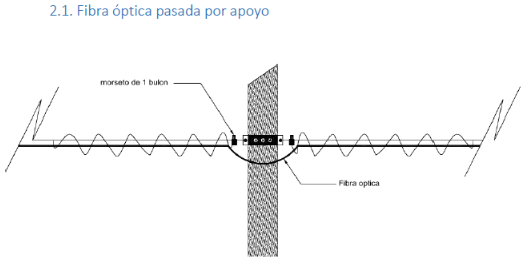
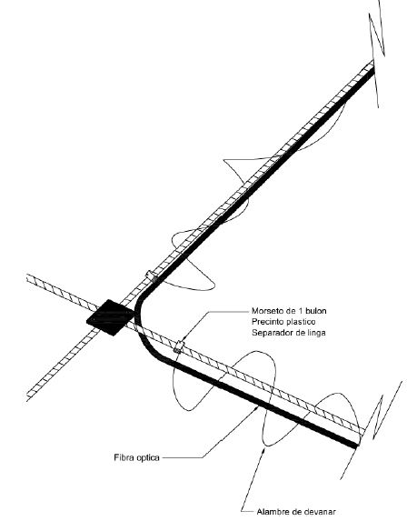

# Tendido de Fibra Óptica de Acceso (TAF)

## 2.1. Detalle constructivo

### Imagen 1: TAF (tendido de fibra por poste pasado)

**Descripción:**  
La fibra óptica se sujeta al poste mediante un **morseto de 1 bulón**, permitiendo su continuidad sin corte en los apoyos intermedios.

---

### Imagen 2: Cruce de calle

**Descripción:**  
La fibra óptica realiza un cruce de calle utilizando **morsetos de 1 bulón** y **alambre de devanar** para asegurar el tendido y garantizar la tensión adecuada.

---

## 3. Consumo de materiales

### Tabla 1: TAF (pasada por apoyo)

| Código  | Descripción           | Unidad | Cantidad |
|---------|------------------------|--------|----------|
| 031034  | Morseto de 1 bulón     | u      | 2        |

---

### Tabla 2: Cruce de calle

| Código  | Descripción           | Unidad | Cantidad |
|---------|------------------------|--------|----------|
| 031034  | Morseto de 1 bulón     | u      | 2        |

---

**Nota:** Las cantidades indicadas corresponden a la instalación típica para cada uno de los casos mostrados. Por cada unidad de apoyo o cruce que llegue indicado desde GIS, deberá contabilizarse lo indicado en la tabla. Finalmente se realizara el "p x q + p' x q'" para obtener los materiales totales en la tarea, siendo p: la cantidad de apoyos, q: la cantidad de materiales indicados en la tabla 1, p': la cantidad de cruces de calle, q': la cantidad de materiales indicados en la tabla 2.  
