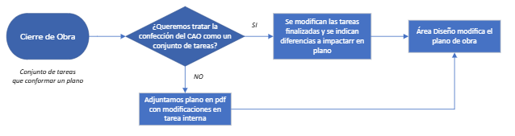
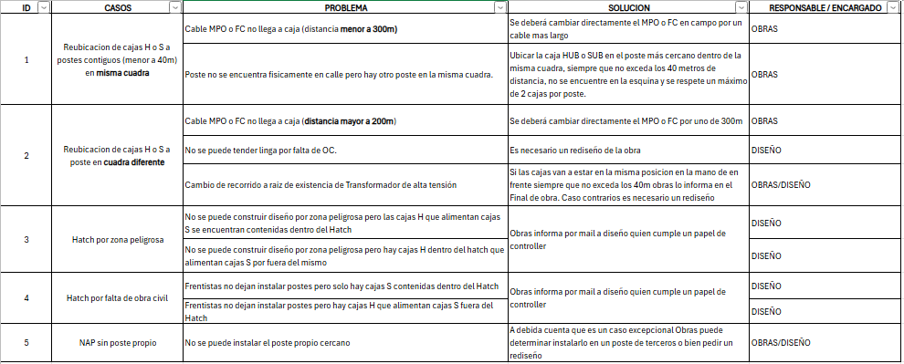
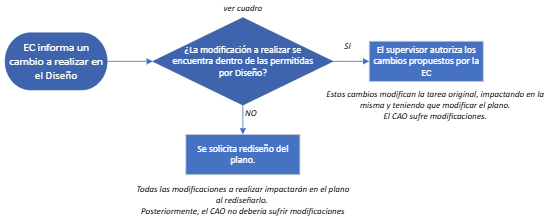

# 🛠️ Confección de CAO por Modificación de Tarea

## Introducción

Actualmente el sistema está preparado para tratar el CAO de un plano como un conjunto de tareas.  
Algunas de ellas con modificaciones a impactar y otras ejecutadas de acuerdo al proyecto.  

La alternativa a esto es usar la tarea interna existente para **adjuntar un plano modificado en PDF**.  
De esta forma solicitaríamos las modificaciones al finalizar el plano.

### ✅ Ventajas

- Es sencillo de interpretar por Diseño ya que no modifica la forma actual de trabajo.
- Ahorra tiempo en el corto plazo.

### ❌ Desventajas

- No aprovecha la estructura del sistema.
- No permite identificar elementos a cambiar, perdiendo trazabilidad.
- No permite un proceso de mejora continua.
- No permite el posterior automatismo para actualización automática de CAO en `.dwg`.

---

## 🧭 Caso de uso: Modificación de tarea para impactar en CAO

### 1. Vías posibles de modificación del proyecto

**a. Se solicita Rediseño de plano: los cambios a realizar no se encuentran dentro de los permitidos por Diseño**

- Se requiere rediseño por parte del área de Diseño.
- Se crea una nueva tarea que reemplaza a la anterior.
- No se modifica la tarea original (ya que fue modificada en el rediseño del plano), y por lo tanto **no se informa ninguna modificación sobre esta**.

**b. Diseño permite la modificación: el supervisor autoriza el cambio a la EC**

- Se modifica tanto el proyecto como la tarea ya creada y despachada a la EC.
- **Debe reflejarse en el CAO.**

En este documento nos enfocamos en el caso **b**, donde **los cambios deben ser informados a Diseño** para actualizar el inventario de red.

---

## ❓ Preguntas

### 1. ¿Vamos a tratar el CAO como un conjunto de tareas?

---

### 2. ¿Cómo llega una tarea al estado de Supervisión donde se puede impactar la modificación?

- La empresa contratista (EC) completa la tarea en **MOICA Público**.
- Esto permite que la tarea pase a la instancia de **Supervisión de Obras**.

---

### 3. ¿Cómo se identifica que una tarea requiere impactar un cambio en el diseño?

**Estado actual:**  
- El supervisor comenta en un campo de observaciones al revisar la tarea.
- El GIS muestra una tabla filtrable con elementos con comentarios.
- La información que llega **no es fácilmente interpretable**, lo que puede provocar errores en el inventario.

**Propuesta de mejora:**  
- Agregar al final del formulario de supervisión un **checkbox**:
  > “¿Desea notificar un cambio a impactar en el plano final de obras?”

- Si se activa el checkbox:
  - Se identifica la tarea.
  - Se permite filtrar por Proyecto.
  - Se agrupan los elementos a modificar en el plano.

---

## ✏️ Edición de tareas en supervisión

### Opción 1: Edición sobre plano

- Mostrar el plano actual desde MOICA Público.
- Permitir editar elementos del plano (apoyos, cajas, fibras, lingas, etc.).

### Opción 2: Dibujar sobre el plano

- Permitir marcar manualmente las modificaciones sobre la imagen del plano.

### Opción 3: Adjuntar archivo

- Subir un archivo PDF con las modificaciones descriptas.

> ✅ Esta opción respeta la modalidad tradicional de comunicación entre Obras y Diseño.

---

## 🧩 Preguntas adicionales

**A. ¿Quién debe alertar del cambio respecto al diseño?**

- **Supervisor:** Mayor control y menos errores, pero más carga operativa.
- **Contratista:** A futuro, podría agilizar el proceso si se implementa bien.

> 💬 *Opinión personal:*  
> En el **corto plazo**, que lo informe el supervisor.  
> En el **largo plazo**, se puede delegar a la EC con mejor usabilidad.

