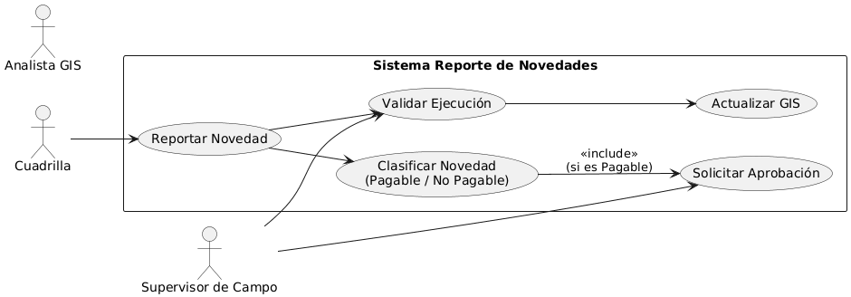

# Caso de Uso: Reporte de Novedades

## Primera casuistica - Descripción
Este caso de uso permite a la **cuadrilla de la empresa contratista** reportar un elemento detectado en calle que **no se encuentra en el plano**.  
El objetivo es **registrar, validar y actualizar** esta novedad en el sistema, de manera que:
- Se evidencie el trabajo realizado.
- Se registre el consumo de materiales.
- Se habilite el pago de la tarea (si corresponde).
- El **GIS** se mantenga actualizado.
- Brinde trazabilidad al área de Obras del avance de proyectos y permita identificar desvíos sobre lo planificado.

---

## Flujo Propuesto

Se identifican dos casos que requerirán flujos de trabajo diferentes.

- **[A1]** La tarea a ejecutar *no requiere* aprobación por parte del supervisor de obras para ser ejecutada.  

*las tareas que no requieren aprobación del supervisor de obras son las tareas no pagables. Ejemplo: la cuadrilla está ejecutando un tendido de linga o fibra e identifica que hay un apoyo pasante no declarado en la tarea (plano). Desde este modulo reporta la novedad y dsiponibiliza este elemento para ser consumidos los materiales asociados.*

- **[A2]** La tarea a ejecutar *requiere* aprobación por parte del supervisor de obras para ser ejecutada.  

*las tareas que requieren aprobación del supervisor de obras son las tareas pagables. Ejemplo: la cuadrilla identifica que hay que instalar un tramo adicional de linga o fibra. Desde este modulo reporta la novedad y dsiponibiliza este elemento para ser consumidos los materiales asociados y pagada la tarea.*

| Tipificaciones pagables | Tipificaciones NO pagables |
|---|---|
| NAS | IRE |
| NAP | FPP |
| TLC (tramo de linga adicional) | TLP |
| TEF (tramo de fibra adicional) |  |

*nota: ver con administración de obras - el cuadro es a modo de ejemplo* 

---

## Actores
- **Cuadrilla** → Actor principal, identifica y reporta la novedad.  
- **Supervisor de campo** → Aprueba si es necesario la ejecución de la tarea (antes). Valida la ejecución de la tarea realizada (despues).  
- **Analista GIS** → VER SI ES NECESARIA LA INTERVENCIÓN EN ALGÚN PUNTO.   

---

## Objetivos del Actor
- Declarar un elemento que no está en el plano.  
- Registrar la tarea para poder consumir materiales y, si corresponde, habilitar el pago.  
- Proporcionar evidencia que brinde trazabilidad al negocio (foto, ubicación, observaciones).  

---

## Flujo Principal
1. La cuadrilla detecta un elemento en calle no reflejado en el plano.  
2. Ingresa a **Moica Público** y selecciona “Reporte de Novedad”.  
3. El usuario identifica la tipificación a realizar.
4. En función de esta selección y la clasificación **Pagable** y **No Pagable**, se envía o no solicitud de aprobación al supervisor de obras de acuerdo al flujo indicado.    
4. La cuadrilla completa el **formulario** con datos, fotos y materiales.   
5. El **supervisor de campo** aprueba la tarea realizada.  
6. El **GIS** recibe la novedad validada.
7. Se notifica esta novedad a diseño para actualizar el plano de Obras.  
7. El proceso finaliza con la novedad registrada, GIS actualizado, tarea con materiales preconsumidos, tarea identificada para ser pagable (*si correspondiese*).  

---

## Flujos Alternativos / Excepciones
- **[A1] Sin conexión en campo:** la novedad se guarda localmente y se envía más tarde.  
- **[A2] Novedad rechazada:** el supervisor no aprueba la novedad y devuelve para corrección.  
- **[A3] Error GIS:** si la integración falla, el sistema guarda el registro y genera una alerta.  
- **[A4] Error MP:** si la información no queda disponible para su posterior pago.

---

## Post-condiciones
- El elemento queda registrado en el sistema.  
- El consumo de materiales se almacena.  
- La tarea queda habilitada para pago (si corresponde).  
- El GIS refleja la novedad.  

---

## Preguntas
- ¿Va a haber relación entre la identificación de la tarea, la apertura de la misma en Moica Publico y el sistema Eta?  
*El circuito actual contempla la creación de la tarea en Viena, posterior enrutamiento en Eta, apertura y completitud de la misma en MP. Definir el circuito de identificación y creación de la tarea para ver si es necesario o no involucrar a Eta.*
- ¿Que sucede si necesito identificar mas de un elemento en una misma tarea a ejecutar?
*Ejemplo: una extensión de red en la cual hay que colocar un apoyo o dos adicional y su correspondiente linga.*
¿Se trabaja cada elemento como si fuera independiente? ¿Se solicita el rediseño de plano y se aguarda? ¿Es posible generar una **tarea** que involucre un conjunto de subtareas y se declare todo junto?  

